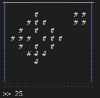

# Game-of-Life
A clone of Conway's Game of Life

## Instructions
Clone the repo, then make sure you run the OOP GoL.py with python3.

## Motivation
Learning OOP in an interesting way

## Build Status

## Screen Shots

The Screen:

## Built With:

* Python3

## Features:

* Save the life cycle you just played
* Replay the a saved life cycle

## Author:

* **Ben Sumser**
